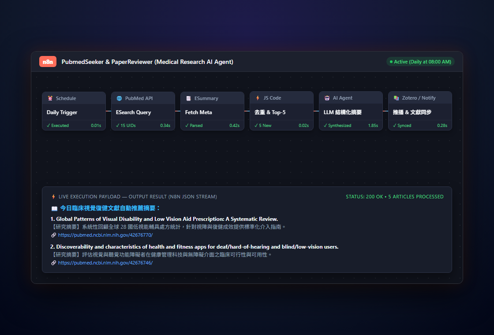

<div align="center">

# 🔬 ResearchAssistant

**Autonomous Biomedical Literature Intelligence & AI Synthesis Pipeline**

[](https://github.com/ian030590/ResearchAssistant/stargazers)
[](https://opensource.org/licenses/MIT)
[](https://n8n.io/)
[](https://pubmed.ncbi.nlm.nih.gov/)
[](https://www.zotero.org/)
[](https://github.com/ian030590/ResearchAssistant/pulls)

<br />

<p align="center">
  
</p>

<p align="center">
  <b>專為醫學、復健與臨床研究團隊設計的自主化文獻情報中樞，整合 NCBI PubMed、Zotero 與頂尖大型語言模型。</b>
</p>

</div>

---

## 📖 目錄 (Table of Contents)

- [產品簡介 (Overview)](#-產品簡介-overview)
- [核心模組架構 (Core Workflows)](#-核心模組架構-core-workflows)
  - [1. PubmedSeeker (文獻情報主動雷達)](#1-pubmedseeker-文獻情報主動雷達)
  - [2. PaperReviewer (結構化論文深度精讀)](#2-paperreviewer-結構化論文深度精讀)
- [系統管線流程圖 (Pipeline Architecture)](#-系統管線流程圖-pipeline-architecture)
- [快速部署指南 (Deployment Guide)](#-快速部署指南-deployment-guide)
- [環境變數與金鑰配置 (Configuration)](#-環境變數與金鑰配置-configuration)
- [AI 結構化輸出規格 (Structured Output Schema)](#-ai-結構化輸出規格-structured-output-schema)
- [專案結構 (Directory Structure)](#-專案結構-directory-structure)
- [授權協議 (License)](#-授權協議-license)

---

## 🌟 產品簡介 (Overview)

在現代生物醫學與臨床復健領域，全球文獻以幾何級數增長，研究人員面臨龐大的「文獻過載（Information Overload）」挑戰。手動設定關鍵字警示往往帶來大量無關雜訊，而閱讀長篇論文 PDF 又耗費大量臨床與研究工時。

**ResearchAssistant** 是一套建構於 [n8n](https://n8n.io/) 自動化平台之上的醫學研究 AI Agent 工作流系統。它無縫整合了 **美國國家生物技術資訊中心 (NCBI PubMed E-Utilities API)**、學術文獻管理中樞 **Zotero** 與先進大型語言模型（OpenAI GPT-4o / Anthropic Claude 3.5 Sonnet），實現文獻追蹤、智慧去重、PDF 解析到結構化精讀總結的全流程自動化。

---

## ⚙️ 核心模組架構 (Core Workflows)

### 1. PubmedSeeker (`PubmedSeeker.json`)
*主動式全球醫學主題文獻定時雷達*

- **多維 MeSH 專業檢索語法**：精準鎖定低視能（Low Vision）、視障復健（Vision Rehabilitation）、神經視覺忽略（Visual Neglect）等關鍵領域，自動排除動物實驗與非相關藥物手術雜訊。
- **動態狀態去重引擎 (Stateful Deduplication)**：運用 n8n 全域靜態資料流儲存已推送之 PubMed UID（可容納近 1,000 篇歷史紀錄），確保絕不重複推播。
- **晨間情報推播 (Daily Morning Digest)**：每天清晨 08:00 自動輸出 Top-5 最具價值新進研究，產出格式化精美 Markdown 訊息並推送至通訊頻道。

### 2. PaperReviewer (`PaperReviewer.json`)
*深度結構化臨床論文 AI 解析引擎*

- **Zotero 書目庫即時監聽**：每小時自動監控 Zotero 雲端收藏夾，一旦研究者加入感興趣之新論文或拖入全文 PDF，即刻觸發深度解析管線。
- **六維度結構化臨床解析架構 (Clinical Evidence Extraction)**：
  1. 🎯 **研究背景與核心假說 (Objective & Hypothesis)**
  2. 👥 **收案族群與納入排除條件 (Participants & Eligibility)**
  3. 🛠️ **介入方案與對照組設計 (Intervention & Dosage Protocol)**
  4. 📐 **主要與次要評估量表 (Outcome Measures & Metrics)**
  5. 📊 **核心統計結果與效應量 (Key Findings & Effect Sizes)**
  6. 💡 **臨床實務意涵與研究限制 (Clinical Implications & Caveats)**

---

## 🏗️ 系統管線流程圖 (Pipeline Architecture)

```mermaid
flowchart TD
    subgraph PubMed["📡 Pipeline A: 全球文獻自動雷達 (PubmedSeeker)"]
        A1["⏰ 每日定時排程 (08:00)"] --> A2["NCBI ESearch (專業 MeSH 檢索)"]
        A2 --> A3["NCBI ESummary (中繼資料抓取)"]
        A3 --> A4["JavaScript 去重過濾與評分"]
        A4 --> A5["格式化推播 (Slack/Discord/Email/試算表)"]
    end

    subgraph Zotero["📚 Pipeline B: 深度精讀與知識沉澱 (PaperReviewer)"]
        B1["⏰ Zotero API 輪詢監聽"] --> B2["偵測未解析新論文與附件 PDF"]
        B2 --> B3["PDF 全文文字串流提取"]
        B3 --> B4["LLM Agent (Claude 3.5 Sonnet / GPT-4o)"]
        B4 --> B5["六維結構化臨床總結"]
        B5 --> B6["自動回寫 Zotero 筆記 (Notes) 與知識庫"]
    end
```



---

## 🚀 快速部署指南 (Deployment Guide)

1. **準備 n8n 環境**：
   可使用本機 Docker、雲端伺服器或 n8n Cloud 啟動實例：
   ```bash
   docker run -it --rm --name n8n -p 5678:5678 -v ~/.n8n:/home/node/.n8n n8nio/n8n
   ```
2. **匯入工作流**：
   - 開啟 n8n 儀表板（預設 `http://localhost:5678`）。
   - 點擊右上角 **「Workflows」 ➔ 「Import from File」**。
   - 分別匯入本儲存庫中的 `PubmedSeeker.json` 與 `PaperReviewer.json`。
3. **設定 API 憑證 (Credentials)**：
   - 在 n8n 中設定您的 OpenAI API Key、Anthropic API Key 以及 Zotero API Key。
4. **啟動工作流**：
   - 將右上角工作流狀態切換為 **「Active」**，即刻開始全天候自動化運作。

---

## 🔑 環境變數與金鑰配置 (Configuration)

| 服務項目 | 所需金鑰 / 變數 | 說明 |
| :--- | :--- | :--- |
| **NCBI PubMed** | `NCBI_API_KEY` (選填) | 選填，填寫後每秒請求上限由 3 次提升至 10 次。 |
| **Zotero** | `Zotero-API-Key` & `User-ID` | 用於讀取個人/研究團隊書目庫並自動回寫結構化分析筆記。 |
| **LLM Engine** | `OPENAI_API_KEY` / `ANTHROPIC_API_KEY` | 驅動 PaperReviewer 進行論文精讀與臨床萃取。 |

---

## 📋 AI 結構化輸出規格 (Structured Output Schema)

```json
{
  "article_uid": "42676770",
  "title": "Global Patterns of Visual Disability and Low Vision Aid Prescription",
  "journal": "Ophthalmic & Physiological Optics",
  "publication_year": 2026,
  "evidence_level": "Level 1 (Systematic Review)",
  "clinical_synthesis": {
    "objective": "評估跨國低視能輔具之處方模式及臨床使用效益",
    "participants": "納入全球 28 國、共計 14,200 名視障與低視能患者",
    "intervention": "光學放大鏡、電子擴視機、偏光濾鏡及視覺功能訓練",
    "key_outcomes": "近距離閱讀速度顯著提升 (SMD = 0.82, p < 0.001)",
    "clinical_takeaway": "個別化輔具評估結合職能治療訓練能顯著改善日常生活獨立自主性。"
  }
}
```

---

## 📁 專案結構 (Directory Structure)

```text
ResearchAssistant/
├── assets/
│   └── screenshot.png         # n8n 畫布工作流與即時資料流展示截圖
├── PubmedSeeker.json          # PubMed 自動檢索、去重與推播 n8n 工作流規範檔
├── PaperReviewer.json         # Zotero 書目監聽與 LLM 結構化精讀 n8n 工作流規範檔
└── README.md                  # 專案技術架構與部署使用文檔
```

---

## 📄 授權協議 (License)

本專案採用 [MIT License](LICENSE) 授權開源。

<div align="center">
  <sub>Crafted with ❤️ by <a href="https://github.com/ian030590">Ian</a>.</sub>
</div>
